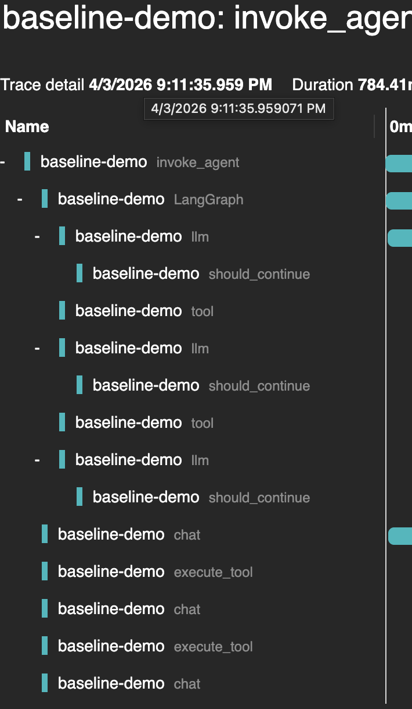
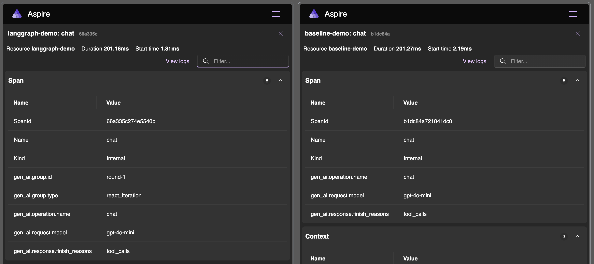
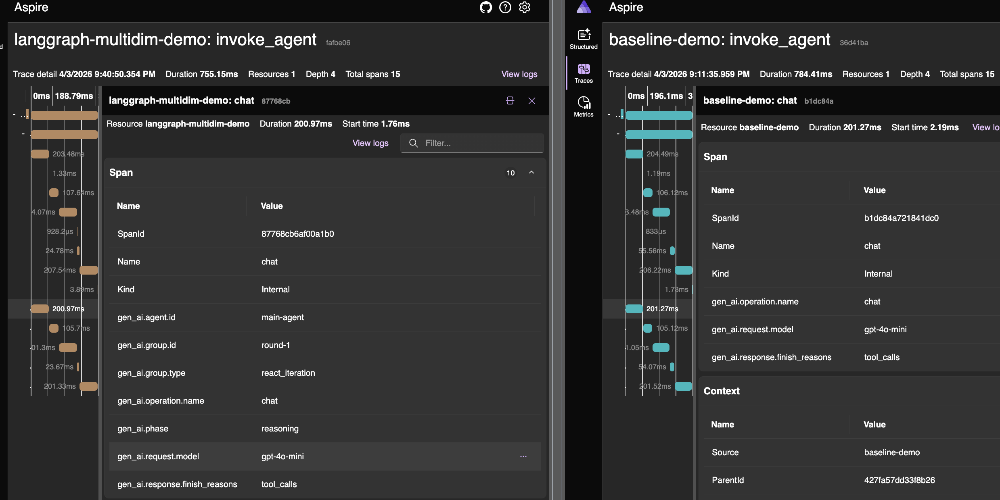
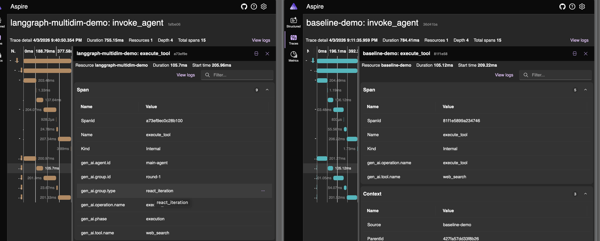
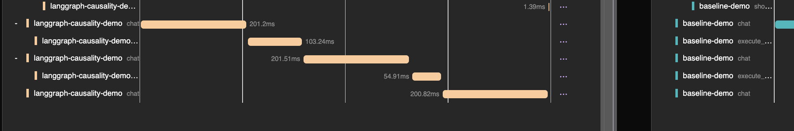
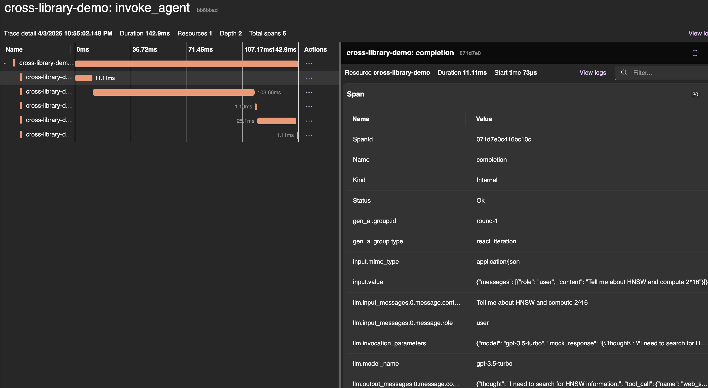
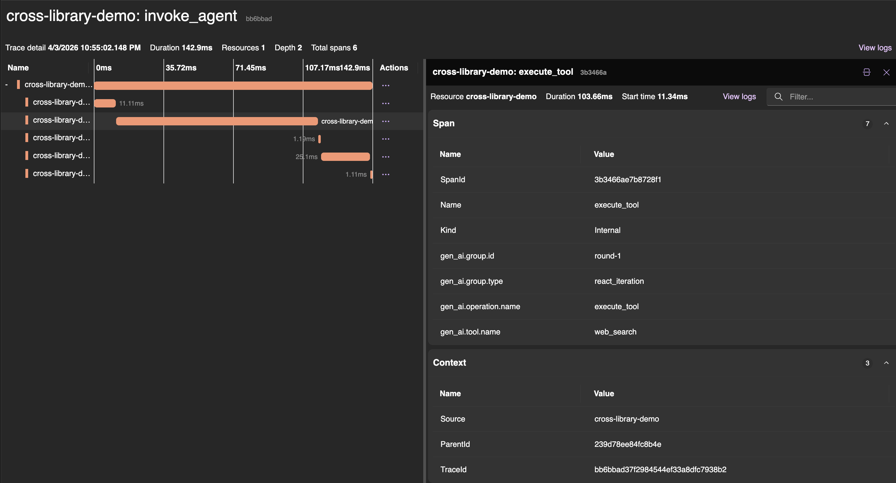
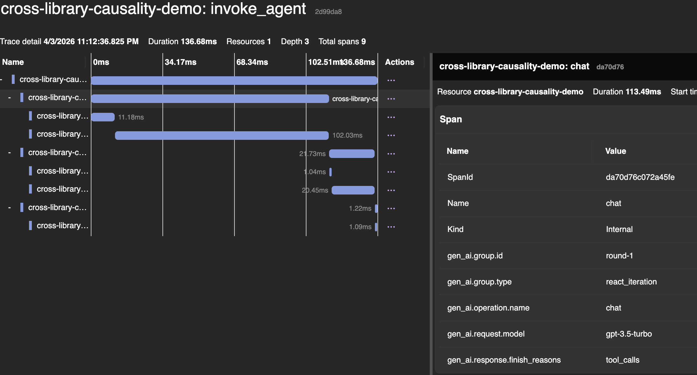
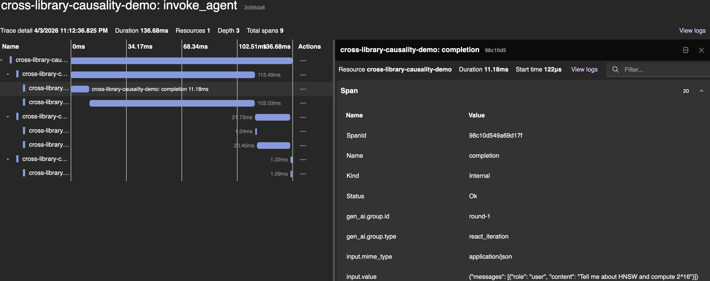
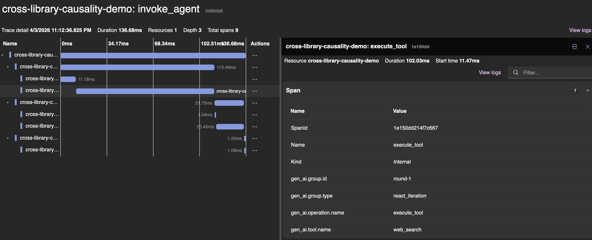

# OTel GenAI Semantic Conventions — Grouping & Causality Prototype

Prototype for [open-telemetry/semantic-conventions#3575](https://github.com/open-telemetry/semantic-conventions/issues/3575).

This repo demonstrates two proposed primitives for OpenTelemetry GenAI semantic conventions:

- **Grouping** — `gen_ai.group.id` carried in W3C Baggage, copied to span attributes via `BaggageSpanProcessor`. Allows spans to be grouped into logical units (ReAct rounds, tasks, steps) without creating wrapper spans.
- **Causality** — Payload-level `traceparent` injection into LLM tool call metadata. Establishes causal links ("this tool was triggered by that LLM call") across library and process boundaries.

## Before / After

| | Before (baseline) | After (with conventions) |
|---|---|---|
| **Grouping** | Flat spans — backend guesses from timestamps | Each span tagged with `gen_ai.group.id=round-N` |
| **Causality** | Tool spans are siblings of LLM spans | Tool spans parented to the LLM call that triggered them |

### Before (Aspire) — Baseline



No `gen_ai.group.id`, no causal links. Backend guesses from timestamps.

### After (Aspire) — Single-dimension Grouping



Spans now carry `gen_ai.group.id=round-1` and `gen_ai.group.type=react_iteration`.

### After (Aspire) — Multi-dimensional Grouping



A single `chat` span belongs to 4 dimensions simultaneously: round, round type, agent, and phase. Directly addresses the reviewer's nesting concern.



`execute_tool` span: same round and agent as `chat`, but `gen_ai.phase=execution` instead of `reasoning`.

### After (Aspire) — Causality via Payload Traceparent



**Left (causality demo):** `execute_tool` spans are **nested under** the `chat` spans that triggered them — a parent-child relationship established via payload `traceparent` injection. The LLM call's span context was injected into the tool call payload (`tool_call["_otel"] = carrier`), and the tool executor extracted it to set the parent (`extract(tool_call["_otel"])`). **Right (baseline):** `chat` and `execute_tool` are flat siblings — no causal link, backend cannot tell which LLM call triggered which tool.

### Cross-Library (LangChain + LiteLLM) — Grouping works, Causality needs payload traceparent



LiteLLM's `completion` span carries `gen_ai.group.id=round-1` — **grouping works across library boundaries**. LiteLLM knows nothing about our convention; `BaggageSpanProcessor` copied it automatically.



`execute_tool` is a flat sibling of `completion`, not a child — **causality requires payload traceparent injection** when spans are created by different libraries with different lifecycles. This is the evidence that the convention must specify traceparent propagation at the message/payload level.

### Cross-Library WITH Causality — `agent_with_causality.py`



After adding payload traceparent injection: trace goes from Depth 2 (flat) to **Depth 3 (nested)**. The `chat` span wraps both LiteLLM's `completion` and `execute_tool` as children.



LiteLLM's `completion` span — created by LiteLLM's instrumentor, not our code — carries `gen_ai.group.id=round-1` (grouping) AND is nested under `chat` (causality). **Both primitives working across library boundaries.**



`execute_tool` is also a child of `chat`, with `gen_ai.group.id=round-1`. The reviewer's "impractical" LangChain + LiteLLM scenario — **proven working.**

> Note: If you see a `gen_ai.causality` attribute on spans in earlier screenshots, this is a **debug label only** — not a proposed semantic convention. The causality is proven by the parent-child relationship in the trace tree itself.

## Demos

| Demo | Framework | Purpose |
|------|-----------|---------|
| [baseline/](baseline/) | LangGraph | **Before** — flat spans, no conventions |
| [langgraph-demo/](langgraph-demo/) | LangGraph | **After** — Baggage grouping + payload traceparent |
| [cross-library-demo/](cross-library-demo/) | LangChain + LiteLLM | Directly answers reviewer's critique — grouping works, causality needs payload traceparent |
| [autogen-demo/](autogen-demo/) | AutoGen v0.4 | Adversarial validation — async event-driven runtime |

## Backends

- **Aspire** (open source) — anyone can reproduce, shows raw span data with attributes
- **Galileo** (production AI observability) — shows what a backend can build with these conventions

## Quick Start

```bash
# Start infrastructure (Collector + Aspire)
docker compose up -d

# Run baseline (before)
cd baseline && python3 -m venv .venv && source .venv/bin/activate
pip install -r requirements.txt && python agent.py

# Run langgraph demo (after)
cd ../langgraph-demo && python3 -m venv .venv && source .venv/bin/activate
pip install -r requirements.txt && python agent.py
```

Aspire dashboard: http://localhost:18888

## Generalizability Matrix

| Framework | Baggage (grouping) | Payload traceparent (causality) |
|-----------|-------------------|-------------------------------|
| LangGraph / LlamaIndex | Works | Works |
| AutoGen v0.4 (async) | Works if runtime propagates context | Message envelope is natural carrier |
| CrewAI | Works (built-in OTel) | Task delegation payload is carrier |
| DSPy | Needs custom processor | Compile-time structure harder |
| Cross-language (Python--.NET) | Won't cross boundary | Only viable mechanism |
| MCP-based tools | Won't cross process | Already HTTP, traceparent native |

> These are not two independent ideas. They are two layers of the same contract. Within a single runtime, use Baggage. At every boundary that crosses async, language, or process lines, use payload traceparent.
