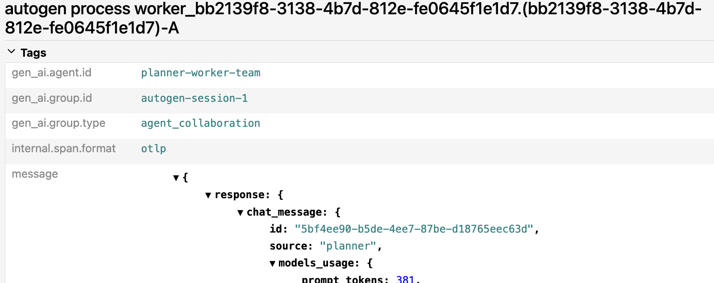

# AutoGen Demo — Async Event-Driven Validation

Validates that Baggage grouping works in AutoGen v0.4's async event-driven runtime — the most adversarial framework category.

AutoGen agents communicate via asynchronous message passing through a runtime. Execution context is explicitly not preserved across message dispatch. The question: does `gen_ai.group.id` set in Baggage before the team invocation survive AutoGen's async dispatch and appear on spans created by AutoGen's runtime?

## What this demo proves about Grouping

- `gen_ai.group.id` set in Baggage before `team.run()` - does it appear on AutoGen's internally created `invoke_agent` and `execute_tool` spans?
- If yes: Baggage grouping works in the hardest async case
- if no: documents the exact boundary where context is lost — evidence for what the convention needs to specify

## What this demo proves about Causality

- AutoGen's runtime creates its own span hierarchy (`invoke_agent` -> `execute_tool`)
- Observing whether the runtime's builtin parent-child relationships are preserved across async dispatch

## Run

```bash
# From repo root — start infra first
docker compose up -d

# Create venv and install
cd autogen-demo
python3 -m venv .venv && source .venv/bin/activate
pip install -r requirements.txt

# Requires OPENAI_API_KEY in ../.env
python agent.py
```

Check Aspire at http://localhost:18888 and Jaeger at http://localhost:16686 - autogen-demo trace

## Screenshots

### Baggage survives AutoGen's async dispatch



AutoGen's internally created `autogen process worker` span carries `gen_ai.group.id=autogen-session-1`, `gen_ai.group.type=agent_collaboration`, and `gen_ai.agent.id=planner-worker-team`. We did not create this span, AutoGen's runtime did. The `BaggageSpanProcessor` copied our Baggage to it automatically, across async message passing between the planner and worker agents. AutoGen knows nothing about these attributes, it just created its autogen process worker span as usual, and our processor attached the grouping data automatically. We proved that baggage-based grouping can survive an async, event-driven agent runtime and be applied to spans created internally by the framework itselfnot only spans created by application code.

we didn't use AutoGen's `SingleThreadedAgentRuntime`(tracer_provider=...) or any of their Core API telemetry setup. We used the high-level AgentChat API (RoundRobinGroupChat, AssistantAgent) and just set the global TracerProvider via trace.set_tracer_provider().

The Baggage propagated anyway because:
1. AutoGen internally picks up the global TracerProvider
2. BaggageSpanProcessor runs on every span start, regardless of who created the span
3. The Baggage context we set was still active when AutoGen's runtime created its spans
So, we didn't need framework specific telemetry configuration. Just the standard OTel global provider + Baggage. That's the whole point of the proposal: it "works" with any framework that uses the global TracerProvider, which is the standard OTel pattern.

Note: this does not prove yet that every async framework preserves baggage the same way that causality is fully modeled, only that AutoGen’s built-in hierarchy appears intact in this case